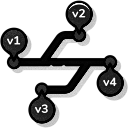

# Korral

## Overview
Korral is a free and open-source alternative to the premium Raidos Systems device. It is designed to provide a simple, efficient, and customizable local automation system. Built around the Raspberry Pi Pico W, Korral leverages MicroPython to deliver a lightweight yet powerful solution for managing switches, metrics, and time-based automation rules. This project is ideal for hobbyists, developers, and anyone interested in IoT and home automation.

---

## Key Features
- **Web-Based Interface**: A clean and intuitive web interface for managing switches and monitoring metrics.
- **Time-Based Automation**: Schedule tasks and automate processes with time-based rules.
- **Lightweight and Efficient**: Optimized for the Raspberry Pi Pico W, ensuring low resource consumption.
- **Customizable**: Easily extendable to meet specific requirements.
- **Free and Open Source**: A cost-effective alternative to commercial solutions.

---

## Project Structure

### Core Python Scripts
- **adc_temp.py**: Handles ADC (Analog-to-Digital Converter) temperature metrics.
- **boot.py**: Initializes the system on startup.
- **logging.py**: Manages logging for debugging and monitoring.
- **main.py**: The main entry point for the application.
- **microdot.py**: Lightweight web framework for handling HTTP requests.
- **microdot_asyncio.py**: Asyncio-based version of the Microdot framework.
- **microdot_utemplate.py**: Template rendering for Microdot.
- **microdot_websocket.py**: WebSocket support for real-time communication.
- **modules.py**: Contains reusable modules for the project.
- **netview.py**: Network monitoring and management.
- **ntp.py**: Handles Network Time Protocol (NTP) synchronization.
- **picoweb_mode.py**: Pico W-specific web server configurations.
- **power_up_record.py**: Tracks power-up events.

### Static Files
- **CSS**:
  - `entireframework.min.css`: Framework for styling.
  - `switchboard.css`: Custom styles for the switchboard interface.
- **JavaScript**:
  - `switchboard.js`: Handles switchboard interactions.
  - `temp.js`: Manages temperature-related scripts.
- **Images**:
  - `dashboard.png`: Screenshot of the dashboard interface.
  - `switch.png`: Image of the device setup.
  - Additional icons and logos for the interface.

### Templates
- **HTML Templates**:
  - `index.html`: Main landing page.
  - `switchboard.html`: Interface for managing switches.
  - `metrics.html`: Displays metrics data.
- **Python Templates**:
  - `index_html.py`: Python-rendered version of the index page.
  - `metrics_html.py`: Python-rendered version of the metrics page.

### uTemplate
- **compiled.py**: Precompiled templates for faster rendering.
- **recompile.py**: Script to recompile templates.
- **source.py**: Source templates for the project.

---

## Firmware Installation
1. **Install MicroPython on Raspberry Pi Pico W**:
   - Download the MicroPython firmware from the [official website](https://micropython.org/download/rp2-pico-w/).
   - Use tools like Thonny or uPyCraft to flash the firmware onto the Pico W.

2. **Upload Project Files**:
   - Connect the Pico W to your computer.
   - Open Thonny or uPyCraft and upload the Python files to the Pico W.

3. **Run the Firmware**:
   - Ensure the `boot.py` and `main.py` files are present on the Pico W.
   - Restart the device to execute the firmware.

---

## Connection Details
- The device hosts a web interface accessible via the Pico W's IP address.
- Use the `main.py` script to configure the Wi-Fi connection and start the web server.
- The web interface provides access to:
  - **Switchboard**: Manage and control switches.
  - **Metrics Dashboard**: Monitor real-time metrics.

---

## Images
Below are some images of the interface and setup:

### Web Interface


### Device Setup


### Additional Images
- **Code Design**: 
- **Routines**: 
- **Version Info**: 

---

## How to Contribute
Contributions are welcome! Here’s how you can help:
1. Fork the repository.
2. Create a new branch for your feature or bug fix.
3. Commit your changes and push them to your fork.
4. Submit a pull request with a detailed description of your changes.

---

## Advanced Usage

### Customizing the Web Interface
The web interface can be customized by modifying the files in the `static` and `templates` directories. For example:
- Update `switchboard.css` to change the styling of the switchboard.
- Modify `index.html` to add new sections or features to the landing page.

### Adding New Metrics
To add new metrics to the dashboard:
1. Create a new Python script to collect the metric data.
2. Update `metrics.html` to display the new metric.
3. Modify `main.py` to include the new script in the web server.

### Extending Functionality
Korral is designed to be modular and extensible. You can add new features by:
- Creating new Python modules in the root directory.
- Adding new routes to the web server in `main.py`.
- Using the Microdot framework to handle additional HTTP requests.

---

## Troubleshooting

### Common Issues
- **Wi-Fi Connection Fails**:
  - Ensure the Wi-Fi credentials in `main.py` are correct.
  - Check that the Pico W is within range of the Wi-Fi network.
- **Web Interface Not Loading**:
  - Verify the Pico W’s IP address.
  - Ensure the `main.py` script is running on the device.
- **Metrics Not Updating**:
  - Check the Python scripts responsible for collecting the metrics.
  - Ensure the scripts are correctly integrated into the web server.

### Debugging Tips
- Use the `logging.py` script to enable detailed logging for debugging.
- Connect to the Pico W via a serial terminal to view real-time logs.

---

## License
This project is free to use and modify. See the LICENSE file for details.

---

## Acknowledgments
- **MicroPython**: For providing a lightweight Python implementation for microcontrollers.
- **Raidos Systems**: Inspiration for creating this open-source alternative.
- **Community Contributors**: For their valuable feedback and contributions.

---

## Future Plans
- **Enhanced Metrics**: Add support for more advanced metrics, such as energy consumption and device uptime.
- **Mobile App Integration**: Develop a companion mobile app for managing the system.
- **Cloud Connectivity**: Enable optional cloud integration for remote access and control.
- **Improved Security**: Implement authentication and encryption for the web interface.

---

## Contact
For questions, suggestions, or support, please contact the project maintainer:
- **Name**: Gideon Kiplangat Rono
- **Email**: gideonkiplangatrono@gmail.com
- **GitHub**: [gideonRono-hue](https://github.com/gideonRono-hue)

---

## Pinout and Connection Guide

### Raspberry Pi Pico W Pinout
Below is the pinout diagram for the Raspberry Pi Pico W used in this project:

### Pin Assignments
The following pins are used in the `main.py` script:

- **GPIO Pins**:
  - GP1: Output
  - GP2: Output
  - GP3: Output
  - GP4: Output
  - GP5: Output
  - GP6: Output
  - GP7: Output
  - GP8: Output
  - GP9: Output

- **ADC Pins**:
  - ADC0: Analog Input
  - ADC1: Analog Input
  - ADC2: Analog Input

### Connecting Components

#### 1. **Power Supply**
- Connect the VBUS pin to a 5V power source.
- Use the GND pin for the ground connection.

#### 2. **Switches**
- Connect one terminal of the switch to a GPIO pin (e.g., GP1).
- Connect the other terminal to the ground (GND).
- Use a pull-up resistor if necessary.

#### 3. **Sensors**
- **Temperature Sensor**:
  - Connect the sensor's VCC to the 3.3V pin.
  - Connect the GND to the ground pin.
  - Connect the data pin to an ADC pin (e.g., ADC0).

#### 4. **LEDs**
- Connect the anode (long leg) of the LED to a GPIO pin (e.g., GP2).
- Connect the cathode (short leg) to the ground via a resistor (e.g., 220Ω).

#### 5. **Wi-Fi Setup**
- The Pico W has built-in Wi-Fi capabilities. Use the `main.py` script to configure the Wi-Fi SSID and password.

### Example Circuit
Below is an example of a simple circuit:
- **Switch** connected to GP1.
- **LED** connected to GP2.
- **Temperature Sensor** connected to ADC0.

```
   +3.3V -----> [Temperature Sensor VCC]
   GND --------> [Temperature Sensor GND]
   ADC0 -------> [Temperature Sensor Data]

   GP1 -------> [Switch Terminal 1]
   GND --------> [Switch Terminal 2]

   GP2 -------> [220Ω Resistor] -----> [LED Anode]
   GND --------> [LED Cathode]
```

Ensure all connections are secure and double-check the pin assignments before powering the device.

---

## Wi-Fi Setup

The Raspberry Pi Pico W in this project is configured to operate as an access point (AP) or connect to an existing Wi-Fi network. Below are the steps to set up Wi-Fi:

### Access Point (AP) Mode
In AP mode, the Pico W creates its own Wi-Fi network, allowing devices to connect directly to it.

1. **Default Configuration**:
   - **SSID**: `K.sysPicoW_AP`
   - **Password**: `12345678`
   - **IP Address**: `192.168.4.1`

2. **How to Enable AP Mode**:
   - The `setup_ap()` function in `main.py` and `boot.py` initializes the access point.
   - The access point is activated with the following configuration:
     ```python
     ap = network.WLAN(network.AP_IF)
     ap.config(essid='K.sysPicoW_AP', password='12345678')
     ap.active(True)
     ap.ifconfig(('192.168.4.1', '255.255.255.0', '192.168.4.1', '8.8.8.8'))
     ```

3. **Connecting to the AP**:
   - On your device, search for the Wi-Fi network `K.sysPicoW_AP`.
   - Enter the password `12345678` to connect.
   - Open a browser and navigate to `http://192.168.4.1` to access the web interface.

### Station Mode
In Station mode, the Pico W connects to an existing Wi-Fi network.

1. **Modify the Code**:
   - Update the `ssid` and `password` variables in `main.py`:
     ```python
     ssid = 'YourNetworkSSID'
     password = 'YourNetworkPassword'
     ```

2. **Enable Station Mode**:
   - Replace the `setup_ap()` function with the following:
     ```python
     wlan = network.WLAN(network.STA_IF)
     wlan.active(True)
     wlan.connect(ssid, password)

     while not wlan.isconnected():
         time.sleep(1)

     print('Connected to Wi-Fi')
     print('IP Address:', wlan.ifconfig()[0])
     ```

3. **Access the Web Interface**:
   - Find the Pico W’s IP address using the `wlan.ifconfig()` method.
   - Open a browser and navigate to the IP address to access the web interface.

### Troubleshooting Wi-Fi
- **AP Mode Not Working**:
  - Ensure the Pico W is powered on and the `setup_ap()` function is called.
  - Check for any errors in the serial console.
- **Station Mode Not Connecting**:
  - Verify the SSID and password are correct.
  - Ensure the Pico W is within range of the Wi-Fi network.

By following these steps, you can configure the Pico W to operate in either AP or Station mode, depending on your requirements.
